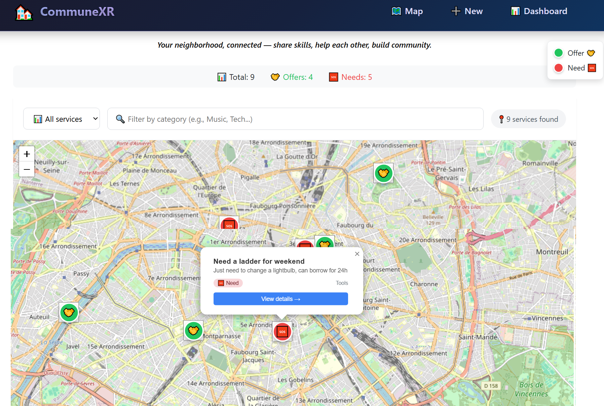
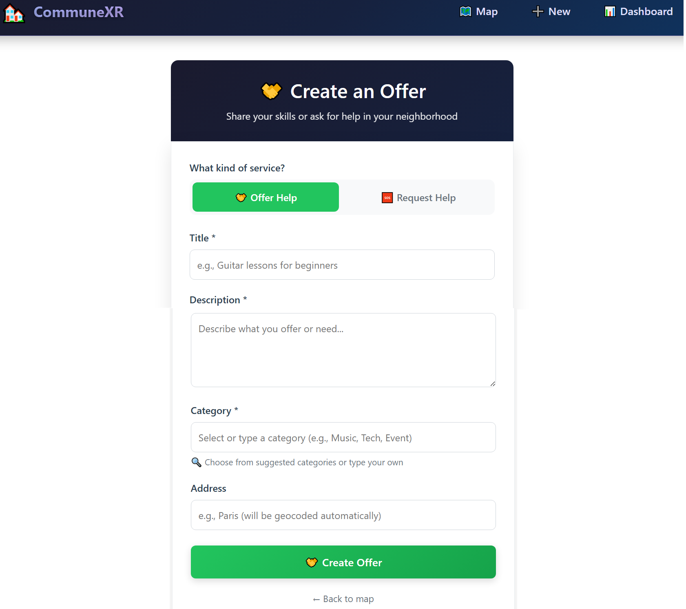
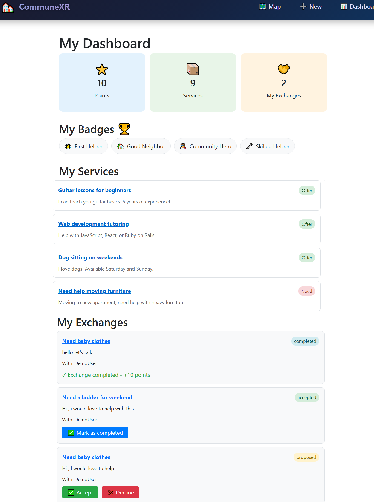
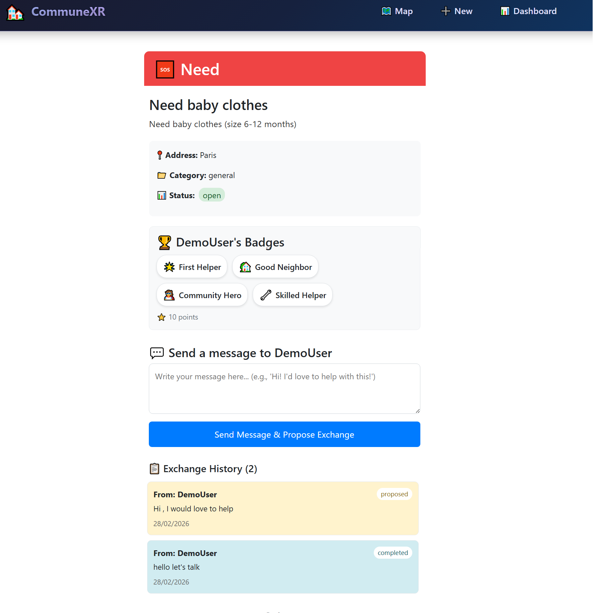

# 🌍 CommuneXR - Frontend


CommuneXR is a community-powered platform that turns your neighborhood into a live map of mutual aid.

Users can post offers or needs, and see them instantly displayed on an interactive map. The goal is simple:

**Make local help visible. Build real connections.**

## 🚀 Live Demo

🔗 **Frontend App:** [https://communexr-front.onrender.com](https://communexr-front.onrender.com)  
🔗 **Backend API:** [https://communexr.onrender.com](https://communexr.onrender.com)

## 📁 Repositories

🔗 **Frontend Repo:** [https://github.com/joupify/communeXR_front](https://github.com/joupify/communeXR_front)  
🔗 **Backend Repo:** [https://github.com/joupify/communeXR](https://github.com/joupify/communeXR)

---

## 🎥 Demo Video

[](https://youtube.com/watch?v=YOUR_VIDEO_ID)

_Click the image above to watch a 2-minute demo_

---

## 📸 Screenshots

|          Interactive Map          |                  Create Service                   |
| :-------------------------------: | :-----------------------------------------------: |
|  |  |

|                   Dashboard                   |              Service Details              |
| :-------------------------------------------: | :---------------------------------------: |
|  |  |

---

## 💡 The Idea

Every community has untapped potential.

Someone can fix a bike.  
Someone needs help moving.  
Someone offers language lessons.

But these needs and skills rarely connect.

**CommuneXR transforms a neighborhood into an interactive support network.**

---

## 🗺️ Core Features

✅ **📍 Interactive map** (Leaflet + OpenStreetMap) with custom markers  
✅ **➕ Create a service** (Offer or Need) with category selection  
✅ **🔎 Filter by type** (offers/needs) **and category** (real-time search)  
✅ **👤 Simple authentication** (DemoUser for the challenge)  
✅ **🏷️ Badge system** with 4 unique badges to earn  
✅ **🔄 Exchange tracking** with status (proposed → accepted → completed)  
✅ **📊 User dashboard** with stats, badges, and exchange history  
✅ **💬 Messaging system** integrated with exchanges  
✅ **🎮 Gamification** with points (10 per completed exchange)

---

## 🧠 How It Works

### User Flow

1. **👀 Browse** the map to see nearby offers (🤝 green) and needs (🆘 red)
2. **🔍 Filter** by category to find exactly what you need
3. **📝 Click** a marker to see details and message the person
4. **💬 Send** a message → creates an exchange proposal
5. **✅ Accept/Decline** exchanges from your dashboard
6. **🏆 Complete** exchanges → earn points and badges!

### Gamification

| Badge             | How to earn                    |
| ----------------- | ------------------------------ |
| 🌟 First Helper   | Complete your first exchange   |
| 🏡 Good Neighbor  | Complete 5 exchanges           |
| 🦸 Community Hero | Complete 10 exchanges          |
| 🔧 Skilled Helper | Help in 3 different categories |

Plus:

- ⭐ **10 points** per completed exchange
- 📈 Badges unlock automatically via Rails callbacks

---

## 🛠️ Tech Stack

### Frontend

- **React 18** with Hooks
- **React Router** for navigation
- **Bootstrap 5** for styling
- **React-Leaflet** for interactive maps
- **OpenStreetMap** for map tiles
- **Netlify/Render** for deployment

### Backend

- **Ruby on Rails 7** (API mode)
- **PostgreSQL** database
- **Devise** for authentication
- **Geocoder** for location services
- **Render.com** for deployment

---

## 🏗️ Architecture

┌─────────────────┐ ┌─────────────────┐ ┌──────────────┐
│ │ │ │ │ │
│ React Frontend│────▶│ Rails API │────▶│ PostgreSQL │
│ (Render) │ │ (Render) │ │ │
│ │ │ │ │ │
└─────────────────┘ └─────────────────┘ └──────────────┘

text

---

## 📊 API Endpoints (used by frontend)

| Method | Endpoint               | Description            |
| ------ | ---------------------- | ---------------------- |
| GET    | `/services`            | List all services      |
| GET    | `/services/:id`        | Get service details    |
| POST   | `/services`            | Create a new service   |
| POST   | `/exchanges`           | Create an exchange     |
| PATCH  | `/exchanges/:id`       | Update exchange status |
| GET    | `/users/:id`           | Get user profile       |
| GET    | `/users/:id/exchanges` | Get user exchanges     |

---

## 🚦 Getting Started

### Prerequisites

- Node.js 18+
- npm or yarn

### Frontend Setup

```bash
# Clone the repository
git clone https://github.com/joupify/communeXR_front.git
cd communeXR_front

# Install dependencies
npm install

# Create .env file with API URL
echo "REACT_APP_API_URL=https://communexr.onrender.com" > .env

# Start development server
npm start
The app will be available at http://localhost:3001

Backend Setup (if running locally)
bash
# Clone the backend repo
git clone https://github.com/joupify/communeXR.git
cd communeXR

# Install dependencies
bundle install

# Setup database
rails db:create db:migrate db:seed

# Start Rails server
rails s -p 3000
📁 Project Structure
text
communeXR_front/
├── public/
├── src/
│   ├── components/     # Reusable components (Map, etc.)
│   ├── pages/          # Page components
│   │   ├── Home.js
│   │   ├── ServiceDetail.js
│   │   ├── NewService.js
│   │   └── Dashboard.js
│   ├── App.js          # Main app with routing
│   └── index.js
├── .env                 # Environment variables
└── package.json
🧪 Testing
bash
npm test
🎯 Why This Project Matters
Modern communities are digitally connected but locally disconnected.

CommuneXR bridges that gap by:

🤝 Encouraging real-world interaction between neighbors

🔧 Promoting skill sharing within the community

🌱 Strengthening neighborhood resilience through mutual aid

🏘️ Building genuine community bonds one exchange at a time

⏳ Built For
DEV Weekend Challenge
Theme: Build an app that serves a community you care about.

🕒 Timeline: 48 hours

👥 Team: Solo developer

🎯 Goal: Create meaningful community impact

📈 What's Next
Real-time chat with WebSockets

Mobile app with React Native

Event calendar for community meetups

Reviews and ratings system

Multi-language support

Push notifications

👤 Author
joupify

GitHub: @joupify

Twitter: @yourtwitter

🙏 Acknowledgments
Leaflet for the amazing mapping library

OpenStreetMap for free map tiles

Render.com for easy deployment

The DEV community for the challenge and inspiration

📝 License
This project is MIT licensed.

Made with ❤️ for my neighborhood during the DEV Weekend Challenge
```
